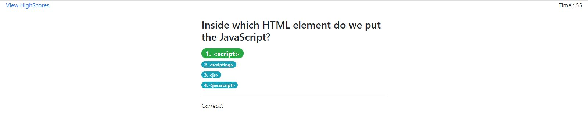

# timedQuiz

A timed quiz with question related to Javascript. Quiz is to be completed in 75 seconds. User must answer all the question in the slotted time period. If the time runs out the quiz ends.
User is given a penalty for each wrong answer by reducing the available time by one second. User's score for the quiz is the time remainig on the clock.
At the end of the quiz, user may enter their initials and save the score in local-storage. User can view past highscroes by clicking the 'HighScores' link. The HighScores can also be cleared from the local-storage.
The Project is deployed at -
https://sandyboon.github.io/timedquiz/

Welcome Screen - 

Quiz Question -

User is shown a response when the select an answer -

